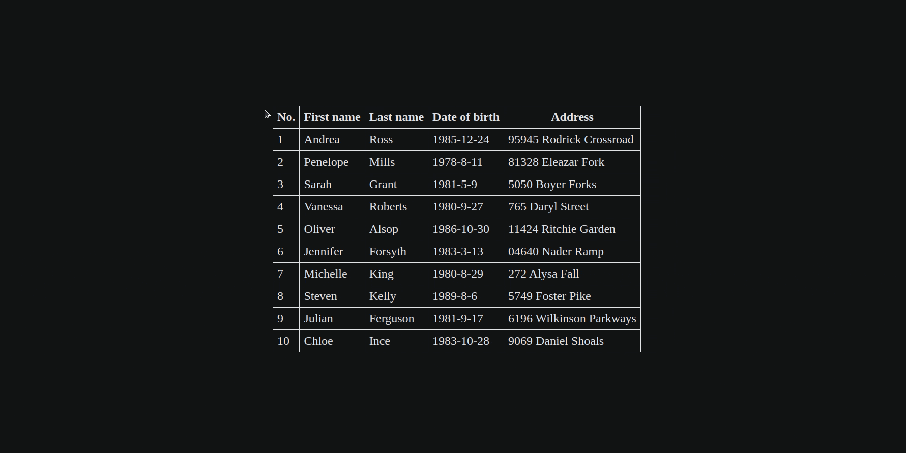

# Drag and Drop Table Dolumn

This is a project for dragging and dropping a column in table.

## Technologies

* HTML
* CSS
* Javascript

## Key Concepts

* When user starts moving a table column, we create a list of items. Each item is cloned from each column of table.

* We show the list at the same position as table, and hide the table.

* At this step, moving column around is actually moving the list item.

* When user drags an item, we determine the index of target item within the list. And swap the columns associated with the dragging and end indexes.

